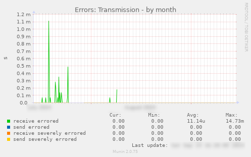
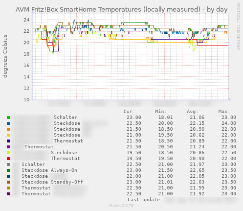
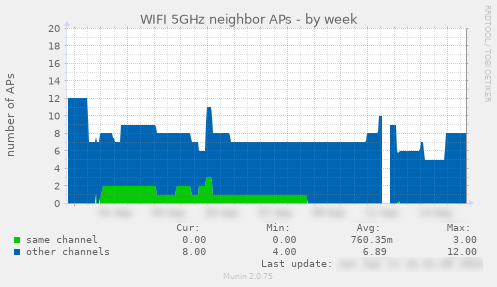

# Munin Plugins for FritzBox

A  collection  of   munin  plugins  to  monitor   your  AVM  FRITZ!Box
router.   The  scripts   have   been  developed   using  a   FRITZ!Box
7490,7590,5690 Pro  running  FRITZ!OS   7.50...7.62  and  a  FRITZ!WLAN
Repeater 1750E running FRITZ!OS 7.27.

If you are using the scripts on a different FRITZ!Box model please let me know by

- opening an issue
- submitting a pull request

These python scripts are [Munin](http://munin-monitoring.org) plugins for monitoring the [FRITZ!Box](https://avm.de/produkte/fritzbox/) router by AVM. 


## Purpose of this Fork

The scripts are build upon the original [fritzbox-munin](https://github.com/Tafkas/fritzbox-munin) with the goal to make use of the modern APIs that FRITZ!OS 7 provides.  
The main differences to the original version are:
- Compatibility with latest FRITZ!OS version using username/password authentication
- No HTML Scraping is used
- All data is fetched either through the TR-064 interface or the JSON API
- Contrary to the original version this fork uses multigraphs: this removes the need to query the same API endpoint multiple times, all multigraph plugins have configuration options to switch individual graphs on and off
- Support for Smart Home devices, e.g. for measuring temperature
- Complete refactoring of the Python code base to make it more robust, use modern language features like type hinting and reuse identical code
- Add possibility to connect to FRITZ!Box via TLS

## Requirements
- FRITZ!Box router with FRITZ!OS >= 07.50 (if you are on an older FRITZ!OS version, select an older version of fritzbox-munin-fast by browsing the tags in this repository)
- Munin 1.4.0 or later is required
- Python 3.x
- Recommendation: python venv installation in munin home directory


## Available Plugins

### Connection Uptime
Plugin: `fritzbox_connection_uptime.py`  
Shows the WAN connection uptime.  


### DSL Errors
Plugin: `fritzbox_dsl.py`  
Multigraph plugin, showing:
 - DSL checksum errors<br>
 - DSL transmission errors<br>
 - line loss<br>
 - signal-to-noise ratio<br>
 - link capacity<br>
 - error correction statistics<br>

### CPU & Memory
Plugin: `fritzbox_ecostat.py`  
Multigraph plugin, showing:
 - memory usage
 - CPU load
 - CPU temperature

Note: Currently not supported by FRITZ!Box 5690 Pro with FRITZ!OS 7.62.

### Smart Home
Plugin: `fritzbox_smart_home.py`  
Multigraph plugin, showing
 - Battery state of battery driven smart home devices
   <br>
 - Energy (kWh aggregated over lifetime) of smart home power devices
   <br>
 - Instantaneous power of smart home power devices (W instantaneously, sub-sampled due to 5 minute munin sampling grid, most accurate in resolution, inaccurate w.r.t. energy/average due to sub-sampling) 
   <br>
 - Average power of smart home power devices (W derived from energy counters, accurate w.r.t. average and hence no sub-sampling issue, tendency to visual noise in 5 minute sampling grid, but exact when averaged e.g. in weekly plots with 30 min sampling grid)
   <br>
       
 - Power switch on/off
 - Voltage measurements for smart home power devivces
   <br>
 - Measured temperature for temperature sensors
   <br>
 - Target temperature for thermostats
 - Humidity sensors
   <br>


### Energy
Plugin: `fritzbox_energy.py`  
Multigraph plugin, showing:
 - power consumption for CPU, WiFi, WAN, Fon, USB and total
 - devices connected on WiFi and LAN
 - system uptime

Note: Currently not supported by FRITZ!Box 5690 Pro with FRITZ!OS 7.62.

### Link Saturation
Plugin: `fritzbox_link_saturation.py`  
Multigraph plugin, showing saturation of WAN uplink and downlink by QoS priority
<br>
    


### Traffic
Plugin: `fritzbox_traffic.py`  
Similar to fritzbox_link_saturation, but single-graph and without QoS monitoring.

### Wifi Load
Plugin: `fritzbox_wifi_load.py`  
Multigraph plugin
 - 2.4 GHz
 - 5 GHz
 - 6 GHz
 - WiFi uplink and downlink bandwidth usage
   <br>
       
 - neighbor APs on same and on different channels
   <br>
       

### Wifi Speed
Plugin: `fritzbox_wifi_speed.py`  
Multigraph plugin
 - 2.4 GHz instantaneous RX and TX speeds per connected device
   <br>
       
 - 5 GHz instantaneous RX and TX speeds per connected device
   <br>
       
 - 6 GHz instantaneous RX and TX speeds per connected device
   <br>
       
 - Ethernet instantaneous RX and TX speeds per connected device
 
## Installation & Configuration

   
1. Pre-requisites for the `fritzbox_traffic` and `fritzbox_connection_uptime` plugins are the [fritzconnection](https://pypi.python.org/pypi/fritzconnection) and [requests](https://pypi.python.org/pypi/requests) package. To install run

    - Recommended: python venv in munin home directory

        ```
        sudo -u munin bash
        cd ~munin
        python3 -m venv venv
        source ~munin/venv/bin/activate
        ~munin/venv/bin/python3 -m pip install -r <path-to-your-git-clone>/requirements.txt
        ```

   - Alternative without venv (pip might complain that the packages are centrally managed by your distribution's packaging tool): 

        ```
        pip install -r requirements.txt
        ```

1. Make sure the FRITZ!Box has UPnP status information enabled. (web interface: _Home Network > Network > Network Settings > Universal Plug & Play (UPnP)_)

1. Copy all the scripts from `src/` folder to `/usr/share/munin/plugins`

1. (optional) If you want to connect to FRITZ!Box using SSL, download the Fritz certificate (web interface: _Internet > Freigaben > FritzBox Dienste > Zertifikat > Zertifikat herunterladen_) and save it to `/etc/munin/box.cer`.

1. Create entry in `/etc/munin/plugin-conf.d/munin-node`, for example (please check further configuration options inside the plugin documentation, typically in form of comments at the top of each plugin):

        [fritzbox_*]

        env.fritzbox_ip           fritz.box
        env.fritzbox_password     <fritzbox_password>
        env.fritzbox_user         <fritzbox_user>
        env.fritzbox_use_tls      true
        env.fritzbox_certificate  <path to certificate used by the FRITZ!Box>
        env.ecostat_modes         cpu temp ram
        env.dsl_modes             capacity snr damping errors crc ecc
        env.energy_modes          power devices uptime
        env.energy_product        DSL

        env.wifi_freqs            24 5 6
        env.wifi_modes            freqs neighbors
        env.locale                de
        env.wifi_speeds_dev_info_storage_path  <path for a temporary .json file where the plugin stores device names in order to "remember" and display their history in the munin-stats even while they are disconnected and do not appear in the stats of the FRITZ!Box, e.g. /var/lib/munin-node/persistent-plugin-state/fritzbox-wifi-speed.json>
        # env.traffic_remove_max   true # if you do not want the possible max values

        host_name                 fritzbox
        user                      munin

   
   See the plugin files for plugin-specific configuration options.

1. For each plugin you want to activate, create a symbolic link to `/etc/munin/plugins`, e.g.:
   ```
   ln -s /usr/share/munin/plugins/fritzbox_dsl.py               /etc/munin/plugins/
   ln -s /usr/share/munin/plugins/fritzbox_connection_uptime.sh /etc/munin/plugins/
   ...
   ```

   <em>Please note that you need to take the .sh version in case of venv usage for fritzbox_traffic and fritzbox_connection_uptime, see above under "Pre-requisites"</em>

1. Restart the munin-node daemon: `service munin-node restart`.

1. Done. You should now start to see the charts on the Munin pages!

## Localization

The `fritzbox_energy` script depends on the language selected in your FRITZ!Box. Currently, two locales are
supported:

1. German: `de` (default)
2. English: `en`

You can change the used locale by setting an environment variable in your plugin configuration:

    env.locale en

## Different hosts for the FRITZ!Box and your system

You can split the graphs of your FRITZ!Box from the localhost graphs by following the next steps:

1. Use the following as your host configuration in `/etc/munin/munin.conf`

        [home.yourhost.net;server]
            address 127.0.0.1
            use_node_name yes


        [home.yourhost.net;fritzbox]
            address 127.0.0.1
            use_node_name no

1. Restart your munin-node: `service munin-node restart`

## Testing

To test a plugin use
```
munin-run --debug fritzbox_connection_uptime.py
```
